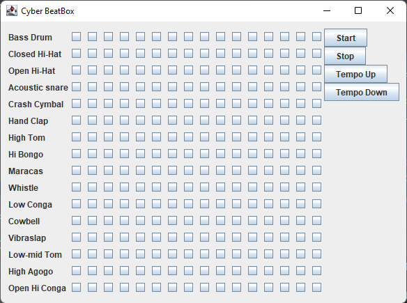

# Cyber BeatBox

Cyber BeatBox is a simple drum machine built in Java using the `javax.sound.midi` package. It allows users to sequence and play various drum beats in a grid-like interface, much like popular drum machines. This project demonstrates the use of MIDI, Swing for GUI development, and basic event handling in Java.
__

## Features
- A 16x16 grid of checkboxes, where each row represents an instrument, and each column represents a beat in the measure.
- Start and stop functionality for the sequencer.
- Tempo control to speed up or slow down the beats.
- 16 different instruments that can be combined to create complex beats.

## Instruments
The following MIDI drum instruments are used in the BeatBox:

1. Bass Drum
2. Closed Hi-Hat
3. Open Hi-Hat
4. Acoustic Snare
5. Crash Cymbal
6. Hand Clap
7. High Tom
8. Hi Bongo
9. Maracas
10. Whistle
11. Low Conga
12. Cowbell
13. Vibraslap
14. Low-mid Tom
15. High Agogo
16. Open Hi Conga

Each instrument is assigned a MIDI key, allowing for the creation of beats on the MIDI drum channel.

## How It Works

### Grid Layout
The user interface features a 16x16 grid of checkboxes, each corresponding to an instrument and a beat. When a checkbox is selected, the instrument associated with that row will play at the selected beat.

### MIDI Sequencing
- The project makes use of Java's `javax.sound.midi.Sequencer`, `Sequence`, and `Track` classes.
- Each instrument is represented by a MIDI key, and the sequencer loops through the 16 beats, playing the corresponding sounds for the selected instruments.
- The `buildTrackAndStart()` method constructs the MIDI sequence based on the current state of the checkboxes and starts the sequencer.

### Buttons and Controls
Four control buttons are provided:
1. **Start**: Starts playing the beat based on the selected checkboxes.
2. **Stop**: Stops the sequencer.
3. **Tempo Up**: Increases the tempo of the sequencer by 3%.
4. **Tempo Down**: Decreases the tempo of the sequencer by 3%.

## Installation and Setup

1. Clone the repository:
    ```bash
    git clone https://github.com/yourusername/beatbox.git
    ```
2. Compile and run the project:
    - Ensure you have Java installed on your machine.
    - Compile the code using `javac`:
        ```bash
        javac BeatBox.java
        ```
    - Run the application:
        ```bash
        java BeatBox
        ```

## Code Structure

### Main Class: `BeatBox`
- **Instance Variables:**
    - `checkBoxArrayList`: Stores the checkboxes that represent each beat for each instrument.
    - `sequencer`, `sequence`, `track`: Handle MIDI sequencing and playback.
    - `instrumentNames[]`: An array of instrument names for labeling the interface.
    - `instruments[]`: An array of corresponding MIDI keys for each instrument.

- **Main Methods:**
    - `buildGUI()`: Constructs the graphical user interface with a grid for beats, instrument labels, and control buttons.
    - `setUpMidi()`: Initializes the MIDI sequencer, sequence, and track.
    - `buildTrackAndStart()`: Constructs a track based on selected checkboxes and starts the sequencer.
    - `changeTempo(float v)`: Adjusts the tempo by a scaling factor.
    - `makeEvent()`: Creates a MIDI event (e.g., NOTE_ON, NOTE_OFF).
    - `makeTracks()`: Generates MIDI events for a specific instrument across all 16 beats.

## How to Use
1. Launch the application.
2. Select any checkboxes to create a beat pattern. Each checkbox corresponds to a specific beat for the given instrument.
3. Click the "Start" button to play the beat.
4. Adjust the tempo using the "Tempo Up" or "Tempo Down" buttons.
5. Click "Stop" to stop the beat at any time.


## Requirements
- Java JDK (version 8 or higher)
- Basic knowledge of Java programming and GUI development

## Future Enhancements
Some potential improvements that could be added to the BeatBox:
- Ability to save and load beat patterns.
- Add volume control for each instrument.
- Improve the user interface for a more modern look.
- Implement additional features like beat quantization or random pattern generation.

## Credits
This project was inspired by the "Head First Java" book and extended for further practice with Java's MIDI API and GUI development.
